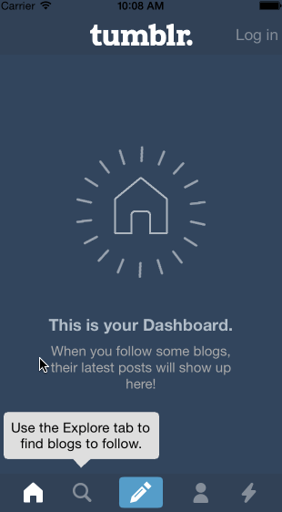

# Week 5 Project: Tumblr
##Overview
This is an assigment I'm working on for the iOS for Designers Bootcamp by CodePath. The purpose of this homework is to leverage animations and gestures to transition between screens. In this prototype, we're recreating interactions in the Tumblr app.

###Time spent: 
12 hours

###Completed user stories:

1. Setup:
    * [x] Create a new project (disable Auto Layout). 
    * [x] Add the image assets above. 
	* [] Configure the app icon and splash screen. 
2. Create initial TabBarViewController view
    * [x] Add a view that is 44 pts tall for the tab bar and choose the color.
    * [x] Add 5 buttons for Home, Search, Compose, Account, and Trending. Be sure to configure them as custom buttons with images for the default and selected state.
    * [x] Add a view for the content above the tab bar. Create an outlet for it called contentView.    
3. Create initial HomeViewController view
    * [x] Add 3 image views for the background, text, and spinner.
    * [x] Create empty HomeViewController class.
4. Create initial SearchViewController
    * [x] Add image view for the search feed.
    * [x] Create empty SearchViewController class.
5. Create initial ComposeViewController view
    * [x] Set the background color of the view to be a blue with some transparency. 
    * [x] Add 6 custom buttons with the compose button images.
    * [x] Add a Nevermind button at the bottom of the view.
    * [x] Create empty ComposeViewController class.
6. Create initial AccountViewController view
    * [x] Add image view for the account view.
    * [x] Create empty AccountViewController class.
7. Create initial TrendingViewController view
    * [x] Add scroll view with embedded image view.
    * [x] Create TrendingViewController class.
    * [x] Create outlets for the scroll view and image view and set the content size of the scroll view.
8. Implement TabBarViewController behavior
    * [x] Connect the tab bar buttons to a shared action function. In that function, add the view of the selected view controller to the contentView.
    * [x] It's useful to track what the currently selected button and view controller is in a property, so you can unselect the button or remove the view controller's view when another button is selected.   
9. Compose Buttons Transition
    * [x] In the ComposeViewController, create an initializer that sets the ComposeViewController as the transitioning delegate. That allows you to use the ComposeViewController to determine how it is presented. See the snippet below.
Guide: Custom View Controller Transitions
10. Login
    * [x] Create a custom view controller transition for the login form.
Guide: Custom View Controller Transitions
11. Bobbing Discover Bubble
    * [x] Add an image view to the custom tab bar controller than animates up and down.
    * [x] When the appropriate button is selected, hide the bubble. Otherwise, show it.
12. Loading
    * [x] Show the custom loading by playing the sequence of pngs.
  
###Notes
I'm feeling better about these concepts.

###Walkthrough of all user stories

GIF created with [LiceCap](http://www.cockos.com/licecap/).

